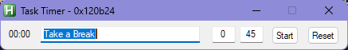
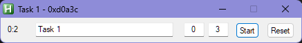

# AutoHotkey Countdown Timer

This AutoHotkey script provides a simple countdown timer that can be used to time tasks and breaks. 

## Usage

- Launch the `ahk` file with AutoHotkey v1 or
- Compile the script to an .exe with `ahk2exe` and launch
- Enter a task name and set the timer. duration in hours and minutes
- Click Start to begin the timer
- A GUI window will count down and alert when time is up

## Features

- Set custom timer duration in **hours** and **minutes**
- Editable task name displayed in title bar  
- Notification as pop-up when timer completes
- Automatically prompts to add new task when idle
- Multiple independent instances can be launched

> Countdown updates every minute by design. Feel free to modify the code to update by seconds or miliseconds.

## Contributing

To contribute to this script:

1. Fork this repo
2. Make changes and commit to your fork
3. Open a pull request against this repo

Enhancement ideas and bug reports welcome!

## Credits

This script was created by Sharvin Suntoobacus from [Code Crafters Corner](https://www.youtube.com/channel/UCZGXfClJ2l8MP0l2bMbHa6w) and uses the AutoHotkey scripting language. The timestamp and timer functions rely on built-in AutoHotkey methods.