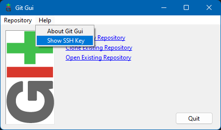
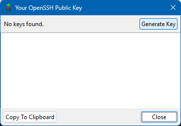

# SSH Connection

This repo shows how to set up an SSH connection to Github.

1. Open Git GUI *(Search in start menu)*.

    

2. Click on `Help > Show SSH Key`.

    

3. Click on `Generate SSH Key`.

    

4. Enter a passphrase and copy the key to clipboard.

5. Login to Github account.

6. Click on `Settings > SSH Keys > New SSH Key`.

7. Paste the copied SSH Key and save.

8. Open `Terminal` and cd to a git repo.

9. Check the remote connection with:

`git remote -v`

10. Change to SSH connection with:

`git remote set-url origin ssh-github-link`

*Note: SSH link can be obtained from Github*

